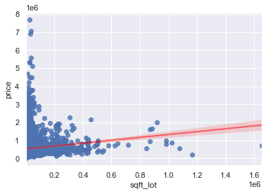

# Project 2: House Hunting for Families in King County

Name:Sam Lim

Course: Data Science Full Time

Date: 3/26/21 4:30 pm EST

Instructor: Claude Fried

## Overview

This project's goal is to find appropriate housing for new families coming into King County after Microsoft has newly hired a large number of people after their expansion into the film industry. The model sing variables such as the number of bathrooms and bedrooms; and the size of the lot and living space. However, the most important factor that affected the price was location and this could be observed after including the zip code variable. 

## Business Problem

A realtorship is experiencing an influx of smaller families coming into King County as Microsoft has expanded into the movie industry and hired substantial amount of workers. It is your job to find a home for these families, and many also live alone. The realtorship has data on the price of King County, but need your insight. 

## Data 

After cleaning the data of misplaced values and other human errors, the variables also needed to be log transformed and scaled to normalize the values for modeling. The dependent variable, price, was only log transformed while independent variables such as sq. ft of living space and sq. ft of lot space were log transformed then scaled by subtracting the original mean value of the variable from its log value then dividing the difference by the square root of the variance of the log value.

## Method

This project uses iterative modeling process and linear regression to estimate the impact of a certain aspect of a house has on its price at King County such as the number of bedrooms and bathrooms, the square footage of the living space and lot space, its officially rated condition, and lastly its zip code. 
 - First the model had to be trained using train test split function at the start to get a more accurate reading on the data. The data was split into a test and train group and each group was passed through linear regression predcition.
 - Then had to show that the data and the model met the three assumptions of linear regression: normality, homoscedesticity, and linearity. 

## Results

Initial models had multicollinearity and heteroscedesticity issues, and because they were not scaled or log transformed, the values' coefficients were also difficult to compare. 

And because of this most of the data showed signs of heteroscedesticity. 

After some changes to the model, variables containing larger numbers were log transformed and scaled, except price. The condition variable was also changed from a numerical varaible into a categorical variable where one of the columns is dropped so that the other columns could have a point of reference to.

The second model suffers from a lower R-squared value and some multicollinearity issues. This was because I had not taken into consideration the effect that a location has on the price of real estate. 

The R-squared and adj R-squared values have increased drastically and multicollinearity issues are gone from other independent variables. Between the zip codes, there still were some values with mid to high levels of multicollinearity, but some had levels close to 1. 

However, when comparing the house prices by zip codes only, the drastic difference could not be avoided. As can be seen from the graph, much of the price differences in houses even with similar specs, come from location. 

## Evaluation

By taking bedrooms, bathrooms, size of living space and lot, and the zipcodes, I believe I was able to portray housing prices in King County well. While zipcode had been ignored at start, the price differences between houses of similar specs could not be explained very well, but with the introduction of zip codes, I realized that much of the price difference had been caused by location. 

 - Because the variable zip codes was categorical, it could not be graphed like condition; however, after observing the mean housing price by zip codes, it was very apparant that zip code played a much bigger role in price determination.   
 
 - Because apartments/condos account for higher prices for houses with a lot size of 0(or other very small number), and thus explains the negative relationship between price and lot size.  
 
## Conclusion

The biggest challenges were first, trying to figure out why the relationship between lot size and number of bedrooms to the price were negative, and much effort was put into trying to make the coefficients be positive in the model. Realizing that area played an important role in determining housing price was very important as it allowed me to view zip codes as a necessary independent variable. While not having much information regarding the actual geographical location of each area as well as other amenities of each zip code may hinder in providing the best recommendation, knowing that each zip code has different price ranges will help narrowing down potential housing for the clients. 
 

 - Organize and categorize different zip codes with housing price range and amenities such as public education, transportation, and other facilities in order to facilitate faster and more suitable recommendations.  
 - Start oragnizing advertisements targeted to those that are looking to move to the King County area to gain possible clients.   
 - In the future, having a better understanding of the local traffic, local shopping/food/activities areas, and other factors that clients are looking for in their new neighborhood, would be able to create more fitted lists for the clients.   
 - Locate houses that are less expensive than those in its neighborhood and are in areas (zip codes) with higher average house price due to a lower condition or etc.   
 - Using the lot size variable, determine if the housing is an apartment/condo, a town house, or a suburban house.   
 - When showing possible candidates, show the price of each sq. ft of living space compared to that of zip code average to help  the clients determine the price level of the house. 